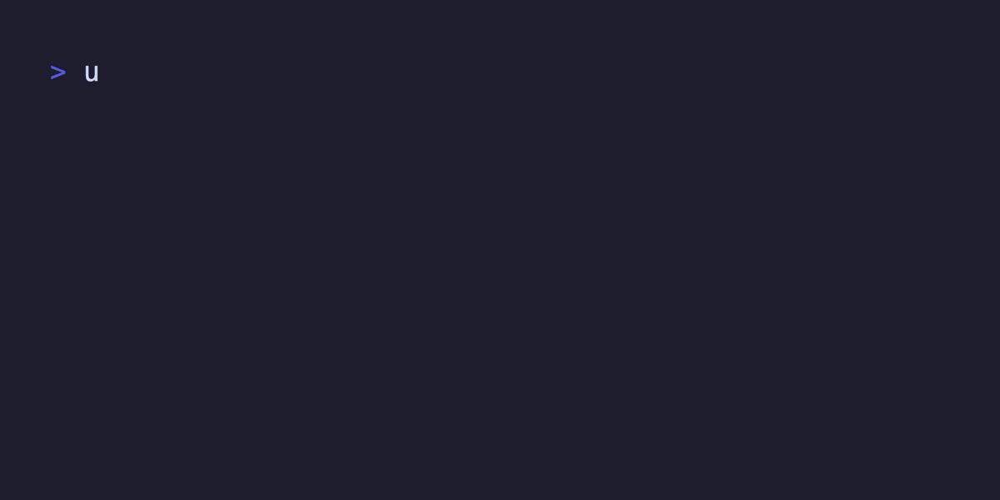
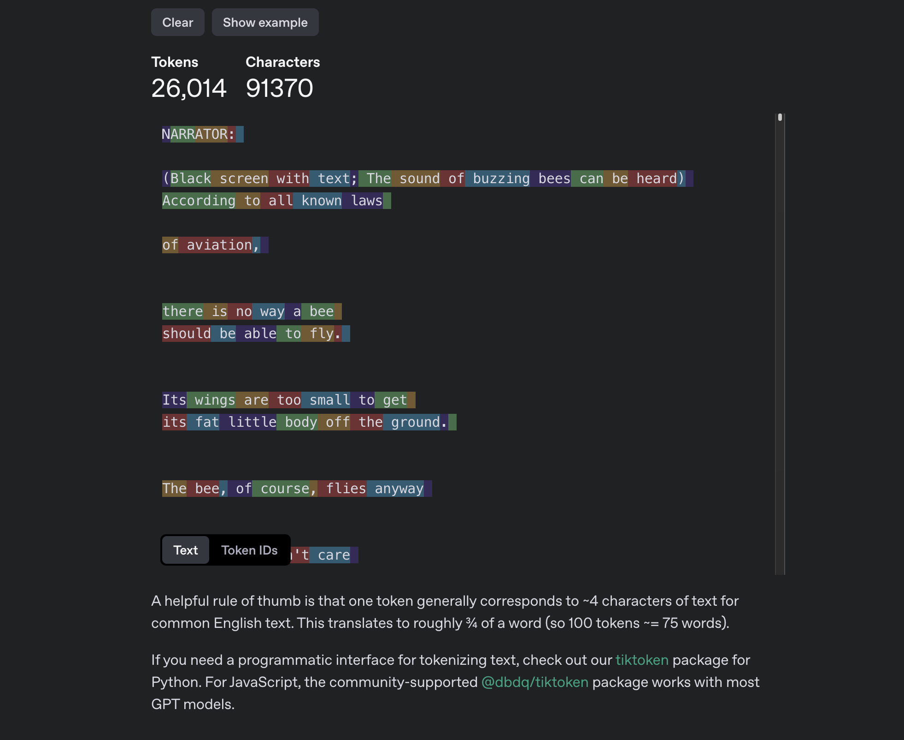
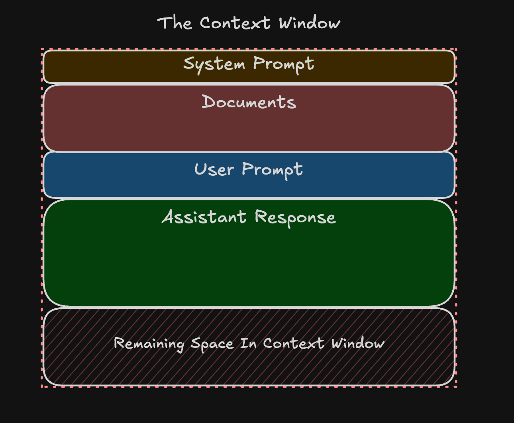

# DDT (Directory Diving Tokenizer)



This is a CLI written in python (and rewritten in golang if i have time) that
will scan a directory and count the number of tokens per text file, subdivided
by filetype. Useful for figuring out how difficult it will be for a Large
Language Model to hold the entirety of a given set of files in its context window.

## Installation and Use

To install DDT, clone this repo and choose the easy path or the hard path:

### The Easy Path

1. Install [uv](https://docs.astral.sh/uv/getting-started/installation/), the
python package and project manager.
2. Run `uv run main.py /PATH/TO/TARGET`

### The Hard Path

1. Set up a python virtual environment with `python3 -m venv .venv`
2. Enter the virtual environment with `source .venv/bin/activate`
3. Run `python -m pip install -r pyproject.toml`
4. Run `python main.py /PATH/TO/TARGET`
5. Remember to run `exit` when you're done to leave the python venv!

You can exclude filetypes by passing in one or more `-e FILETYPE` flags,
or you can include specific filetypes with one or more `-i FILETYPE` flags.
You cannot specify both.

To save your output as a JSON file, pass the `-j` or `--json` flag followed by
a filename such as `out.json`.

DDT will attempt to ignore files that do not seem to contain text. If you encounter
unhandled errors, please file a bug report using the Issues tab in github.

## What are Tokens?



Large Language Models, despite the name, do not understand language like you or I.
Instead, they understand an encoding (technically an embedding) of chunks of text
called tokens. A token can be a single letter like 'a', or it can be a word like
'the'. Some tokens include leading spaces (e.g. ' be'), to preserve sentence structure.
On average, a token works out to about 0.75 of an English word.

If you'd like to see examples of how text is broken up into tokens, check out
OpenAI's [Token Calculator](https://platform.openai.com/tokenizer) in their API
reference documentation.

## What is the Context Window?



For a Large Language Model, the context window represents "active knowlege" -
Information immediately relevant to the autocompletion algorithm LLMs use to
generate text. These tokens are what influences how the LLM uses the data it
has been trained on to predict the next token, which gets added to the context
and included in the next prediction. When the context window is full, the model
will begin behaving in unintended ways:

- The LLM might simply run out of tokens and stop generating text.
- The LLM might "forget" the oldest bit of information and behave strangely.
- The LLM might hallucinate information that no longer appears in the data.
- LLM Agents might lose functionality or send malformed input to its actions.

The current generation of LLMs (e.g. GPT-4o, GPT-o1, Claude Sonnet 3.5) have a
context window of 128,000 or 200,000 tokens. Future models are expected to have
between 500,000 and 1,000,000 tokens. The upper limit is currently unknown.

For reference: [curl](https://github.com/curl/curl) is approximately 1,750,000 tokens.

## Help Commands

```bash
❯ : uv run main.py -h
Hello from tokenizer!
usage: Tokenizer [-h] [-v] [--respect-gitignore] [--ignore-dotfiles] [-m {gpt-4o,gpt-4o-mini,gpt-4-turbo,gpt-4}] [-j JSON] [-e EXCLUDE | -i INCLUDE] directory

Crawls a given directory, counts the number of tokens per filetype in the project and returns a per-type total and grand total

positional arguments:
  directory             the relative or absolute path to the directory you wish to scan

options:
  -h, --help            show this help message and exit
  -v, --verbose         set to increase logging to console
  --respect-gitignore   exclude files found in the .gitignore file - NOTE: not implemented yet.
  --ignore-dotfiles     exclude files and directories beginning with a dot (.) - NOTE: not implemented yet.
  -m, --model {gpt-4o,gpt-4o-mini,gpt-4-turbo,gpt-4}
                        specify a model to use for token approximation. default is 'gpt-4o'
  -j, --json JSON       save the results of the scan to a json file at the location specified. does not include stdout messages.
  -e, --exclude EXCLUDE
                        specify file formats to ignore from counting. this flag may be set multiple times for multiple entries. cannot be set if including files
  -i, --include INCLUDE
                        specify file formats to include when counting. this flag may be set multiple times for multiple entries. cannot bet set if excluding files

Made with <3 by 0x4D5352
```
